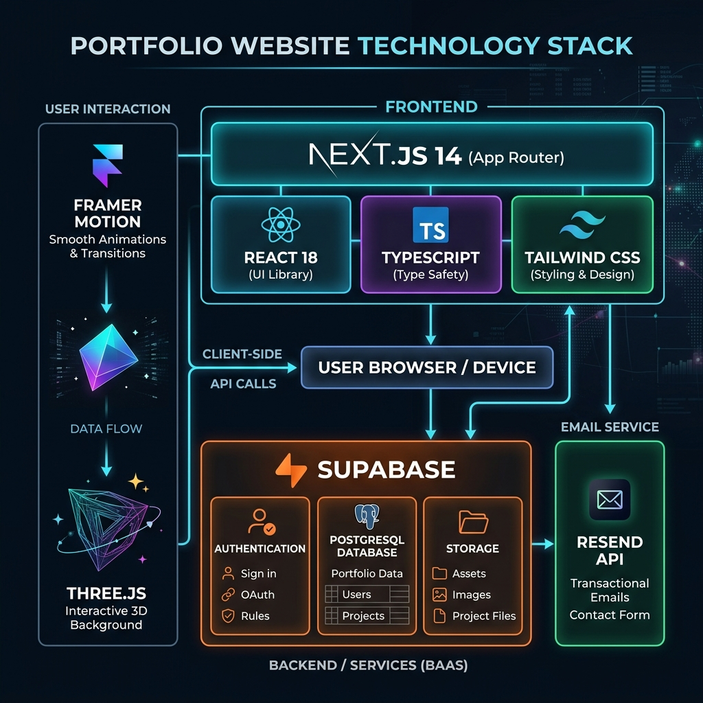
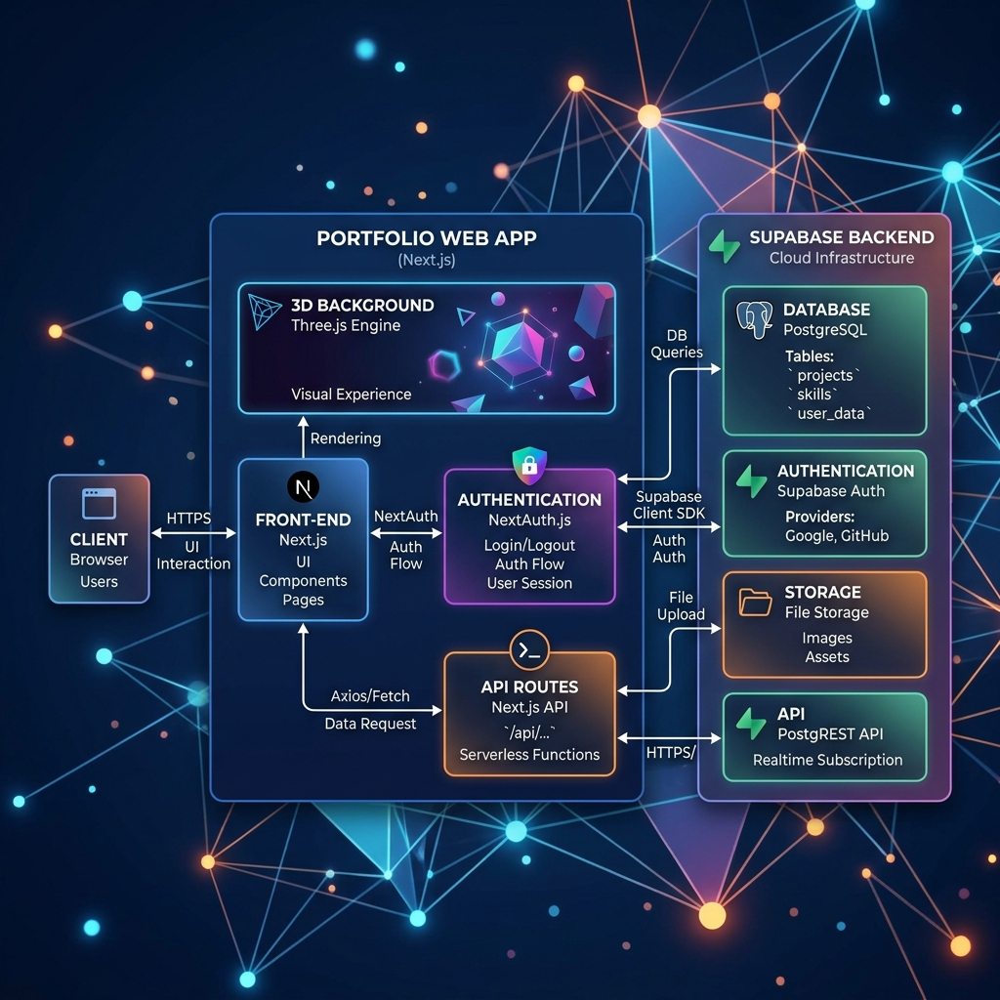

# Muhammad Arslan — Professional Portfolio

A production‑ready, enterprise‑level personal portfolio website built with **Next.js 14**, TypeScript, Supabase, Framer Motion, and Three.js.

## Stack
- **Frontend:** Next.js 14 (App Router), React, TypeScript, Tailwind CSS
- **Backend:** Next.js API Routes (Serverless Functions)
- **Database:** Supabase PostgreSQL
- **Auth:** Supabase Auth
- **Storage:** Supabase Storage
- **3D Background:** Three.js
- **Animations:** Framer Motion
- **Email:** Resend API

## Technology Stack Diagram


## Architecture Diagram


## Setup

1. Clone and install:
```bash
 git clone https://github.com/Arslan-web-Dev/arslan-portfolio.git
 cd arslan-portfolio
 npm install
```
2. Set up environment variables in `.env.local` (see template).
3. Run the Supabase SQL setup.
4. Start development:
```bash
 npm run dev
```

## Deployment

Deploy to Vercel:
```bash
 vercel --prod
```

## Admin Panel

Access <a href="/admin/login" target="_blank">/admin/login</a> to manage content.

## Author

**Muhammad Arslan** — Full Stack Developer | BSCS Final Semester, COMSATS University Islamabadrchitecture_design_1782124135215.png)

# Workflow Logic


# API & Backend

# Frontend UX


# Analytics & Reports


# Code Quality


# Deployment


## Setup

1. Clone and install:
```bash
git clone https://github.com/Arslan-web-Dev/arslan-portfolio.git
cd arslan-portfolio
npm install
```
2. Set up environment variables in `.env.local` (see `.env.local` template)
3. Run the Supabase SQL setup from the prompt in your Supabase SQL Editor
4. Start development:
```bash
npm run dev
```

## Deployment

Deploy to Vercel:
```bash
vercel --prod
```

## Admin Panel

Access <a href="/admin/login" target="_blank">/admin/login</a> to manage content. Create an admin user in Supabase Authentication first.

## Author

**Muhammad Arslan** — Full Stack Developer | BSCS Final Semester, COMSATS University Islamabad

## Architecture Diagram


## Database Schema Diagram


## Setup

1. Clone and install:
```bash
git clone https://github.com/Arslan-web-Dev/arslan-portfolio.git
cd arslan-portfolio
npm install
```
2. Set up environment variables in `.env.local` (see `.env.local` template)
3. Run the Supabase SQL setup from the prompt in your Supabase SQL Editor
4. Start development:
```bash
npm run dev
```

# Architecture Design


# Database Design


# Authentication & RBAC


# Workflow Logic


# API & Backend


# Frontend UX


# Analytics & Reports


# Code Quality


# Deployment


## Deployment

Deploy to Vercel:
```bash
vercel --prod
```

## Admin Panel

Access <a href="/admin/login" target="_blank">/admin/login</a> to manage content. Create an admin user in Supabase Authentication first.

## Author
**Muhammad Arslan** — Full Stack Developer | BSCS Final Semester, COMSATS University Islamabad
