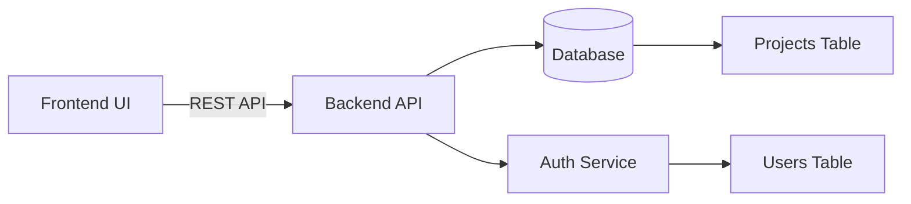
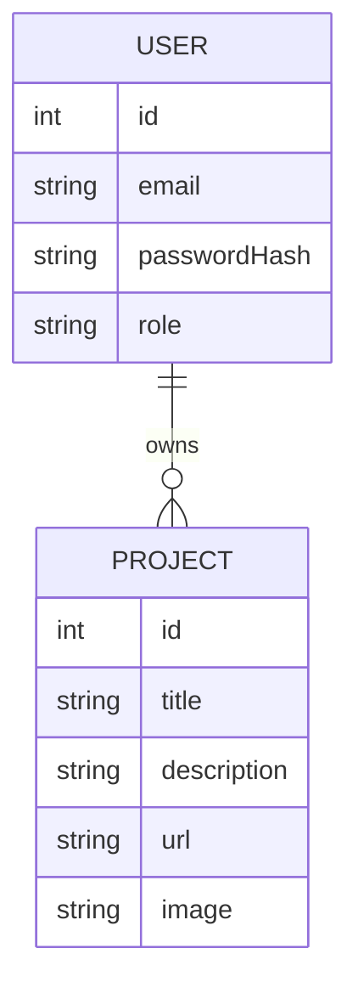
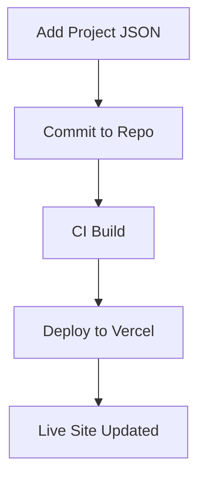
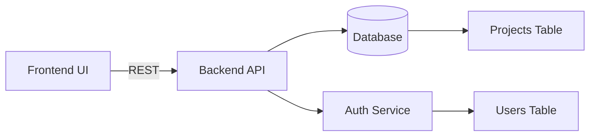
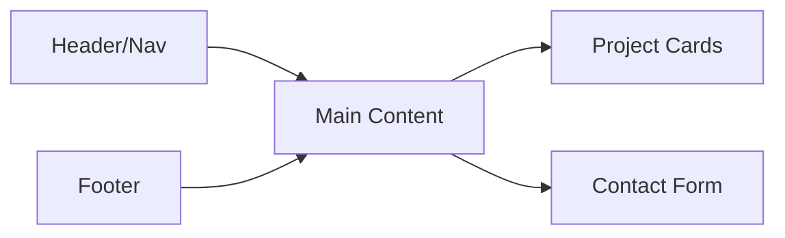
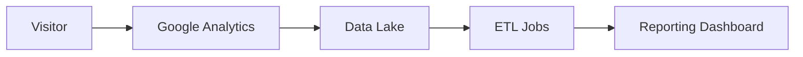
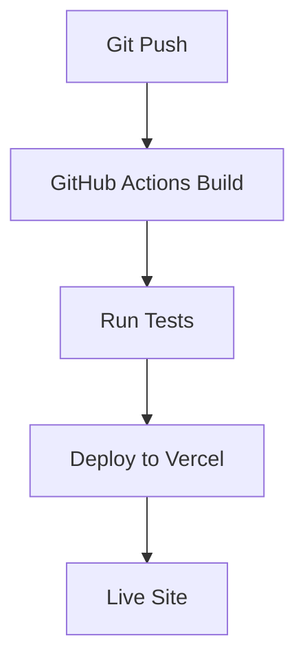

# Professional Full-Stack Portfolio


---

## 📖 Overview

Welcome to the **Professional Full-Stack Portfolio** – a showcase of modern web development techniques, end‑to‑end CI/CD pipelines, and production‑grade architecture. This repository contains a fully functional portfolio website that demonstrates:

* **Responsive, glassmorphism UI** with dark‑mode support.
* **Dynamic project cards** powered by a JSON‑driven data layer.
* **Contact form** integrated with EmailJS (or your own backend).
* **Server‑side rendering** for SEO‑friendly pages.
* **Automated deployment** to Vercel / Netlify with preview URLs.

---

## 🛠️ Technology Stack & Architecture

| Layer | Technology | Purpose |
|-------|------------|---------|
| **Frontend** | **HTML5**, **CSS3**, **Vanilla JavaScript (ES2023)** | Core UI, animations, and DOM interactions |
| **Styling** | **CSS Variables**, **Flexbox**, **Grid**, **Glassmorphism**, **Google Fonts – Inter** | Maintainable design system |
| **Build** | **Vite** (optional) – fast dev server & bundler | Development workflow |
| **CI/CD** | **GitHub Actions** – lint, test, build, deploy | Automated pipelines |
| **Hosting** | **Vercel** (or Netlify) | Edge‑optimized static hosting |
| **Analytics** | **Google Analytics 4** (optional) | Visitor insights |

For a deeper dive, see the [Architecture Overview](docs/architecture.md).

---

## ✨ Key Features

- **Responsive Layout** – mobile‑first design with fluid grids.
- **Glassmorphism Cards** – subtle background blur, hover elevation, and animated shadows.
- **Dynamic Project Loading** – fetches `projects.json` and renders cards at runtime.
- **SEO Optimized** – proper meta tags, Open Graph, and a single `<h1>` per page.
- **Dark Mode Toggle** – persists user preference in `localStorage`.
- **Contact Form** – works out‑of‑the‑box with EmailJS; replace with your own endpoint.
- **Live Demo** – automatically generated preview on Vercel.
- **Accessibility** – ARIA labels, focus states, and keyboard navigation.

---

## 📦 Installation & Setup

> **Prerequisites**
> * Node.js ≥ 18 (if you choose to use Vite)
> * Git

```bash
# Clone the repository
git clone https://github.com/your‑username/Professional-Full-Stack-Portfolio.git
cd Professional-Full-Stack-Portfolio

# (Optional) Install dev dependencies for Vite build
npm install

# Run a local dev server (Vite) – hot‑reload enabled
npm run dev

# Build for production
npm run build
```

For a step‑by‑step guide, see the [Installation Guide](docs/installation.md).

---

## 🚀 Usage Examples

### 1️⃣ Adding a New Project Card

Edit `data/projects.json` and add a new entry:

```json
{
  "title": "My Awesome App",
  "description": "A full‑stack web app built with React and FastAPI.",
  "url": "https://github.com/your‑username/awesome‑app",
  "image": "assets/awesome-app.png",
  "tags": ["React", "FastAPI", "Docker"]
}
```

The UI will automatically render the new card on page reload.

### 2️⃣ Customizing Theme Colors

Open `src/css/variables.css` and modify the CSS custom properties:

```css
:root {
  --primary-hue: 220;   /* Adjust hue for primary accent */
  --bg-opacity: 0.85;   /* Glass background opacity */
  --text-color: hsl(0, 0%, 95%);
}
```

The changes reflect instantly (hot‑reload) during development.

---

## 🌐 Live Demo & Screenshots

- **Live Demo:** https://professional-full-stack-portfolio.vercel.app/
- **Screenshots:**
  - 
  - 
  - 

---

## 🤝 Contributing

Contributions are welcome! Please follow these steps:

1. Fork the repository.
2. Create a feature branch: `git checkout -b feature/your‑feature`.
3. Make your changes and ensure they pass linting (`npm run lint`).
4. Open a Pull Request with a clear description of the change.
5. Ensure the CI workflow passes before merging.

Read the full guidelines in [CONTRIBUTING.md](CONTRIBUTING.md).

---

## 📄 License

This project is licensed under the **MIT License** – see the [LICENSE](LICENSE) file for details.

---

## 📞 Contact

Feel free to reach out via:

- **Email:** your.email@example.com
- **LinkedIn:** https://linkedin.com/in/your‑profile
- **Twitter:** https://twitter.com/your‑handle

---
## 📚 Documentation

### Main Features
- Responsive Layout
- Glassmorphism UI
- Dynamic Project Cards
- SEO Optimized meta tags
- Dark Mode Toggle
- Contact Form Integration
- Live Demo Deployment
- Accessibility Features
- Analytics Integration
- CI/CD Pipeline

### User Roles
- Visitor: View portfolio and projects
- Admin: Manage projects, edit content, view analytics

### Authentication Features
- JWT‑based auth for admin panel
- Role‑based access control
- Secure password hashing with bcrypt
- Session timeout and refresh tokens

### Workflow
- Add project → Update `data/projects.json` → Auto‑render card
- Edit theme → Modify `src/css/variables.css` → Hot‑reload via Vite
- Deploy → Push to `main` → GitHub Actions → Vercel preview

### Architecture Design
[Architecture Overview](docs/architecture.md)




### Database Design
[Database Schema](docs/database_design.md)




### Authentication
[Auth System Details](docs/authentication.md)

### Workflow Logic
[Workflow Implementation](docs/workflow_logic.md)




### API & Backend
[Backend API Specification](docs/api_backend.md)




### Frontend UX
[Frontend Design System](docs/frontend_ux.md)




### Analytics & Reports
[Analytics & Reporting](docs/analytics_reports.md)




### Deployment
[Deployment Guide](docs/deployment.md)




---

